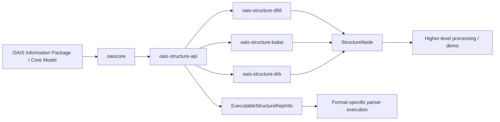

# OAIS Structure Adapters

This project provides a small Java framework for attaching OAIS `StructureRepInfo`
objects to concrete binary-format parsers without making the core OAIS model depend
on any specific parser implementation.

The repository contains a vendored `oaiscore` module plus three adapter modules:

- `oais-structure-api` — engine-agnostic interfaces and abstractions
- `oais-structure-dfdl` — Apache Daffodil-backed adapter
- `oais-structure-kaitai` — Kaitai Struct-backed adapter
- `oais-structure-drb` — DRB-backed adapter via reflection
- `oais-structure-demo` — runnable example

## What this project does

The core idea is to keep the OAIS model independent from parsing engines while still
allowing an executable representation of a data format to act as a valid OAIS
`RepresentationInformation`.

The key abstraction is `ExecutableStructureRepInfo`, which lets a parser-backed
structure descriptor be executed against a digital object and return a normalized
`StructureNode` tree.

The adapters convert engine-native results into a common structure model so higher-level
code can work with a single abstraction regardless of the underlying parser.

## Module layout

```text
root/
├─ pom.xml
├─ README.md
├─ .gitignore
├─ oaiscore/
├─ oais-structure-api/
├─ oais-structure-dfdl/
├─ oais-structure-kaitai/
├─ oais-structure-drb/
└─ oais-structure-demo/
```

## Architecture at a glance



At a high level, the core OAIS model stays generic, while adapter modules map engine-specific
parsing outputs into a single `StructureNode` representation that can be consumed uniformly.

## Module-by-module overview

- `oaiscore`  
  Vendored OAIS core model classes, including the `RepresentationInformation` and related types
  that the adapter layer builds on.

- `oais-structure-api`  
  Contains the engine-agnostic abstractions such as `StructureNode`, `ExecutableStructureRepInfo`,
  and the `StructureInterpreterProvider` SPI. This is the layer that downstream code should depend on.

- `oais-structure-dfdl`  
  Bridges Apache Daffodil into the OAIS structure model. It executes a DFDL schema and converts the
  parsed result into the common `StructureNode` tree.

- `oais-structure-kaitai`  
  Bridges Kaitai Struct-generated parsers by reflection. It works against generated Java classes by
  reading their getters and runtime metadata to reconstruct a structure tree.

- `oais-structure-drb`  
  Bridges DRB through reflection so the module does not require a compile-time DRB dependency. This
  makes it usable in environments where the proprietary library is not available on Maven Central.

- `oais-structure-demo`  
  Demonstrates how the adapters plug into the OAIS model and produce executable structure information
  for a concrete example format.

## Quick start

Prerequisites:

- Java 17+
- Maven

From the project root, run:

```bash
mvn install
```

To run the demo:

```bash
mvn -pl oais-structure-demo exec:java
```

## Project status

This repository is a clean Maven reactor intended to be built from the project root.
The current workspace build was verified successfully with:

```bash
mvn test -q
```

## Notes on external dependencies

This project intentionally keeps the abstraction layer independent from engine-specific APIs.
The adapter modules do, however, depend on third-party libraries such as:

- Daffodil
- Kaitai Struct runtime
- DRB, when available in a local environment

The DRB module is designed to avoid a hard compile-time dependency on DRB jars because
those artifacts are not published to Maven Central; it resolves the engine by reflection
at runtime.

## DRB example description

The DRB adapter is intended to wrap a DRB factory/resolver and expose its parsed tree through
the same `StructureNode` API used by the DFDL and Kaitai adapters. In practical terms, a DRB
example is a format definition that a DRB resolver can parse into a node tree with fields such as
name, value, children, and attributes.

A typical DRB-backed example is:

1. a DRB format descriptor or resolver class supplied by the local environment,
2. a `DrbFormatSpecification` pointing at that resolver,
3. a `DigitalObject` containing the target byte stream,
4. a `StructureInterpreterProvider` that resolves the DRB instance and converts the resulting DRB node
   tree into a `StructureNode`.

The important point is that downstream application code does not need to know whether the source
of structure information came from DRB, Kaitai, or DFDL. All three are normalized to the same tree
shape before semantic interpretation is applied.

## Contributing

Contributions are welcome. Please keep changes focused, add tests for behavior changes,
and update the documentation when public interfaces or module structure change.

A typical workflow is:

```bash
git checkout -b feature/my-change
mvn test
```

## License

This project is intended for open-source use, but the exact license should be confirmed before
publishing externally. Add the appropriate SPDX license file and header if this repository is to
be distributed publicly.

## Extending the project

A new parser backend can be added by creating a module that:

1. depends on `oais-structure-api`
2. provides a concrete `FormatSpecification`
3. implements an `ExecutableStructureRepInfo`
4. registers a `StructureInterpreterProvider` via the Java `ServiceLoader` mechanism

This keeps the common OAIS-facing code stable even as new binary parsers are added.

## Release checklist

Before publishing or sharing the repository externally:

- confirm the license is correct and included in the repo
- verify Java and Maven requirements are documented clearly
- confirm external engine dependencies are noted for each adapter
- review any proprietary or non-public DRB integration notes
- run the full reactor build from the project root
