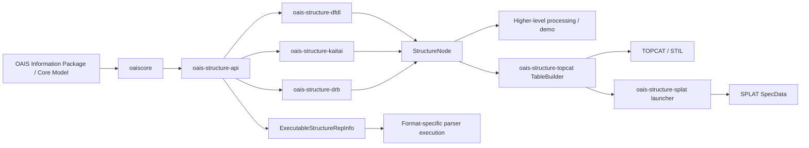

# OAIS Structure Adapters

This project provides a small Java framework for attaching OAIS `StructureRepInfo`
objects to concrete binary-format parsers without making the core OAIS model depend
on any specific parser implementation.

The repository contains a vendored `oaiscore` module plus three adapter modules:

- `oais-structure-api` — engine-agnostic interfaces and abstractions
- `oais-structure-dfdl` — Apache Daffodil-backed adapter
- `oais-structure-kaitai` — Kaitai Struct-backed adapter
- `oais-structure-drb` — DRB-backed adapter via reflection
- `oais-structure-demo` — runnable example

## What this project does

The core idea is to keep the OAIS model independent from parsing engines while still
allowing an executable representation of a data format to act as a valid OAIS
`RepresentationInformation`.

The key abstraction is `ExecutableStructureRepInfo`, which lets a parser-backed
structure descriptor be executed against a digital object and return a normalized
`StructureNode` tree.

The adapters convert engine-native results into a common structure model so higher-level
code can work with a single abstraction regardless of the underlying parser.

## Digital preservation potential

From an OAIS and digital preservation point of view, DFDL, Kaitai Struct and DRB descriptions are
themselves a form of `RepresentationInformation`: they are what lets a future Designated Community
extract meaning from a bag of bytes whose original software may be long gone. This project's own test
fixtures deliberately keep all three engines in lockstep on the same couple of toy shapes (a
fixed-width binary "point" record, a delimited text table) so results are directly comparable while
the adapters themselves are being developed - that says nothing about the ceiling on what each
language can actually describe.

Here's what these three languages are actually used for, in real-world practice, beyond this
project's toy fixtures. This is an initial list, not exhaustive, and the hope is that it grows as more
formats get real DFDL/Kaitai/DRB descriptions written for them:

- **DFDL** (OGF standard; implemented by Apache Daffodil, IBM and others) - built for text/binary
  *record* formats that predate XML/JSON:
  - Financial messaging: SWIFT MT, ISO 20022, FIX
  - Legacy mainframe: COBOL copybook-described fixed-width/EBCDIC files
  - Healthcare: HL7 v2 (pipe-delimited)
  - Defense/government: military message formats (USMTF, VMF), EDI (X12)
  - Scientific/telemetry: NASA/JPL has used DFDL for spacecraft instrument telemetry - one of the use
    cases that shaped the standard

- **Kaitai Struct** - built for reverse-engineering arbitrary binary formats; its public format
  gallery has hundreds of real specs:
  - Media containers: MP4, AVI, WAV, MIDI
  - Executable/binary formats: ELF, PE/EXE, Mach-O, Java `.class`
  - Filesystem/forensics: NTFS, ext2, Windows registry hives, prefetch files, event logs - popular in
    malware analysis and CTF challenges
  - Archive/compression formats, game asset formats, network protocol/packet formats (PCAP)

- **DRB** (GAEL Systems, developed for ESA) - a federated "virtual filesystem" over heterogeneous
  Earth Observation data products, used in Sentinel ground-segment tooling:
  - Satellite product containers combining multiple files (SAFE format)
  - netCDF, HDF5, JPEG2000 satellite imagery, DIMAP, GeoTIFF
  - XML metadata and archive containers (ZIP/TAR) wrapping the above

Not every format is a good fit for this project's approach, though - these languages describe
*structured, record-oriented* data (text/binary grammars), not free-form compound documents. A
`.docx` file, for instance, is a ZIP of XML parts; Kaitai could parse the ZIP's central directory, but
there's no sensible row/column or spectrum projection of a document's actual content, so it wouldn't
gain anything from `oais-structure-topcat`/`oais-structure-splat`'s view-as-a-table approach the way a
telemetry record or an EO product's binary payload would.

The value of being able to look at described data with tools such as TOPCAT and SPLAT is that a large
proportion of information, once you look past its original container format, logically boils down to
tabular or vector (spectrum/time-series) form - which is exactly what those two viewers are built to
show. A significant proportion of the rest is image data, which neither TOPCAT nor SPLAT is the right
tool for; identifying existing software that can display and work with image data the same way (a
`StructureNode` → image bridge, analogous to the table/spectrum bridges this project already has) is a
natural next direction, not yet started.

## Module layout

```text
root/
├─ pom.xml
├─ README.md
├─ .gitignore
├─ oaiscore/
├─ oais-structure-api/
├─ oais-structure-dfdl/
├─ oais-structure-kaitai/
├─ oais-structure-drb/
├─ oais-structure-demo/
├─ oais-structure-topcat/
└─ oais-structure-splat/
```

## Architecture at a glance



At a high level, the core OAIS model stays generic, while adapter modules map engine-specific
parsing outputs into a single `StructureNode` representation that can be consumed uniformly.

## Module-by-module overview

- `oaiscore`  
  Vendored OAIS core model classes, including the `RepresentationInformation` and related types
  that the adapter layer builds on.

- `oais-structure-api`  
  Contains the engine-agnostic abstractions such as `StructureNode`, `ExecutableStructureRepInfo`,
  and the `StructureInterpreterProvider` SPI. This is the layer that downstream code should depend on.

- `oais-structure-dfdl`  
  Bridges Apache Daffodil into the OAIS structure model. It executes a DFDL schema and converts the
  parsed result into the common `StructureNode` tree.

- `oais-structure-kaitai`  
  Bridges Kaitai Struct-generated parsers by reflection. It works against generated Java classes by
  reading their getters and runtime metadata to reconstruct a structure tree.

- `oais-structure-drb`  
  Bridges DRB through reflection so the module does not require a compile-time DRB dependency. This
  makes it usable in environments where the proprietary library is not available on Maven Central.

- `oais-structure-demo`  
  Demonstrates how the adapters plug into the OAIS model and produce executable structure information
  for a concrete example format.

- `oais-structure-topcat`  
  A `uk.ac.starlink.table.TableBuilder` plugin for [TOPCAT](https://github.com/Starlink/starjava/tree/master/topcat),
  Starlink's astronomy table viewer, so it can open data described by a DFDL schema, a Kaitai Struct
  generated class, or a DRB descriptor directly, via `StructureInterpreterFactory` and
  `TableSemanticRepInfo` — no new parsing logic of its own. See "TOPCAT example description" below.

- `oais-structure-splat`  
  Opens the same DFDL/Kaitai/DRB-described data as a spectrum in [SPLAT](http://www.starlink.ac.uk/splat/),
  Starlink's spectral analysis tool, by reusing `oais-structure-topcat`'s `OaisStructureTableBuilder`
  to build a `StarTable`, then wrapping it as a `SpecData` and handing it to a live `SplatBrowser`. See
  "SPLAT example description" below.

## Quick start

Prerequisites:

- Java 17+
- Maven

From the project root, run:

```bash
mvn install
```

To run the demo:

```bash
mvn -pl oais-structure-demo exec:java
```

## Project status

This repository is a clean Maven reactor intended to be built from the project root.
The current workspace build was verified successfully with:

```bash
mvn test -q
```

## Notes on external dependencies

This project intentionally keeps the abstraction layer independent from engine-specific APIs.
The adapter modules do, however, depend on third-party libraries such as:

- Daffodil
- Kaitai Struct runtime
- DRB, when available in a local environment

The DRB module is designed to avoid a hard compile-time dependency on DRB jars because
those artifacts are not published to Maven Central; it resolves the engine by reflection
at runtime.

## DFDL example description

The DFDL adapter is meant to take a DFDL schema and apply it to an actual binary payload. In a
normal usage pattern, the format is described by a schema such as `point.dfdl.xsd`, the byte stream
is loaded from a resource or file, and the Daffodil processor produces an infoset that is then mapped
into the common `StructureNode` tree.

A typical DFDL-backed example is:

1. a DFDL schema resource describing the binary layout,
2. a `DfdlFormatSpecification` pointing to that schema,
3. a `DigitalObject` containing the target byte stream,
4. a `StructureInterpreterProvider` that runs the Daffodil processor and normalizes the result into
   a `StructureNode`.

## Kaitai example description

The Kaitai adapter is designed around generated parser classes produced from `.ksy` descriptions.
In the demo, the format is modeled in [oais-structure-kaitai/src/main/ksy/point2d.ksy](oais-structure-kaitai/src/main/ksy/point2d.ksy),
then consumed by a generated Java parser class that exposes a structured object model. The adapter
reflects over that generated class and turns the resulting values into the same `StructureNode` shape
used elsewhere in the project.

A typical Kaitai-backed example is:

1. a `.ksy` format definition,
2. a generated Java parser class built from that definition,
3. a `KaitaiFormatSpecification` pointing at the generated class,
4. a `DigitalObject` containing the target byte stream,
5. a `StructureInterpreterProvider` that reflects the parser output into a `StructureNode` tree.

## DRB example description

The DRB adapter is intended to wrap a DRB factory/resolver and expose its parsed tree through
the same `StructureNode` API used by the DFDL and Kaitai adapters. In practical terms, a DRB
example is a format definition that a DRB resolver can parse into a node tree with fields such as
name, value, children, and attributes.

A typical DRB-backed example is:

1. a DRB format descriptor or resolver class supplied by the local environment,
2. a `DrbFormatSpecification` pointing at that resolver,
3. a `DigitalObject` containing the target byte stream,
4. a `StructureInterpreterProvider` that resolves the DRB instance and converts the resulting DRB node
   tree into a `StructureNode`.

The important point is that downstream application code does not need to know whether the source
of structure information came from DRB, Kaitai, or DFDL. All three are normalized to the same tree
shape before semantic interpretation is applied.

## TOPCAT example description

`oais-structure-topcat` lets [TOPCAT](https://github.com/Starlink/starjava/tree/master/topcat),
Starlink's astronomy table viewer, open a data file described by any of the three engines above,
by implementing STIL's `uk.ac.starlink.table.TableBuilder` on top of the same
`StructureInterpreterFactory` → `StructureNode` → `TableSemanticRepInfo` pipeline the demo uses -
no new parsing logic, and no fork of `starjava` itself. STIL is a real published Maven Central
artifact (`uk.ac.starlink:stil`), not something requiring a source build.

Because a DFDL/Kaitai/DRB description is inherently external to the raw data bytes (unlike a
self-describing format such as FITS or VOTable), `OaisStructureTableBuilder` needs a convention
for finding it. For a data file `some/dir/foo.ext`, it looks for these siblings (`foo` being the
data file's name with its own last extension stripped) - the same `point.bin` + `point.dfdl.xsd` +
`point-table-view.xml` naming this project's own demo fixtures already use, not a new convention
invented for this module:

| Sidecar | Purpose |
|---|---|
| `foo.dfdl.xsd` | A DFDL schema, used via `DfdlFormatSpecification`. |
| `foo.ksy.classname` | A one-line text file naming an already-compiled, already-on-classpath Kaitai Struct generated class (see `KaitaiFormatSpecification`'s own Javadoc for why a runtime `.ksy` path alone is not enough). |
| `foo.drb.properties` | Optional `factoryResolverClassName`/`protocolHint` properties for `DrbFormatSpecification`'s 3-argument constructor. |
| `foo.drb` | Present (even empty) opts a file into DRB's own auto-detecting no-argument `DrbFormatSpecification()` instead. |
| `foo-table-view.xml` | Required alongside any of the above - the `TableViewSpecification` describing how to view the resulting `StructureNode` tree as rows and columns. |

Requiring an explicit sidecar for every engine, including DRB (whose underlying library can
auto-detect a format with no hint at all), keeps `looksLikeFile()` predictable: this builder only
ever claims a file it has direct sidecar evidence for.

**Registering with TOPCAT** needs no source changes to `starjava`: `StarTableFactory` loads extra
`TableBuilder`s by classname from a system property
(`StarTableFactory.KNOWN_BUILDERS_PROPERTY`, `startable.readers`). This module pulls in Daffodil's
whole Scala stack plus every adapter's runtime, so rather than listing each jar on the classpath by
hand, collect them into one folder with `maven-dependency-plugin` and let Java's classpath wildcard
(`dir/*`, expanded by the JVM itself, not the shell) pick them all up:

```bash
mvn -pl oais-structure-topcat dependency:copy-dependencies -DincludeScope=runtime
mvn -pl oais-structure-topcat package
```

then launch TOPCAT with the module's own jar plus that dependency folder added to the classpath
(quote the wildcard so your shell doesn't try to expand it itself):

```bash
java -Dstartable.readers=info.oais.infomodel.structure.topcat.OaisStructureTableBuilder \
     -cp "topcat-full.jar:oais-structure-topcat/target/oais-structure-topcat-0.0.1-SNAPSHOT.jar:oais-structure-topcat/target/dependency/*" \
     uk.ac.starlink.topcat.Driver point.bin
```

(Windows: use `;` instead of `:` between classpath entries, and give `topcat-full.jar` its full
path if it isn't in the current directory.) This also needs a Java 17+ runtime to run TOPCAT itself
under -- check `java -version` resolves one; a system `java` pinned to something older (Java 8, say)
will fail to load this module's classes with an `UnsupportedClassVersionError` even though the build
itself succeeded.

`OaisStructureTableBuilderTest` (in `oais-structure-topcat/src/test`) verifies this same path end to
end automatically -- real bytes, through the real DFDL and Kaitai adapters, into a real STIL
`StarTable` -- without needing a TOPCAT install; the manual launch above (confirmed working) is only
needed to see it inside TOPCAT itself.

## SPLAT example description

`oais-structure-splat` opens the same DFDL/Kaitai/DRB-described data as a spectrum in
[SPLAT](http://www.starlink.ac.uk/splat/), Starlink's spectral analysis tool. Unlike TOPCAT, SPLAT
has no plugin-registration hook equivalent to STIL's `startable.readers` system property -- its own
format dispatch is a hard-coded switch over known formats, so it can't be told about an arbitrary new
`TableBuilder` at the command line. Instead `OaisStructureSpectrumLauncher` builds the `StarTable`
itself, reusing `OaisStructureTableBuilder.makeStarTable` directly (the exact same engine dispatch
TOPCAT uses), wraps it as a `SpecData` via `SpecDataFactory.get(StarTable, String, String)`, and adds
it to a running `SplatBrowser` via `SplatBrowser.addSpectrum(SpecData)` -- confirmed against
`SplatBrowser`'s own source as the supported way to hand it a programmatically-built spectrum.

**Building splat.jar.** Unlike `stil`, `splat` is not published on Maven Central, so it has to be
built from the `starjava` source tree and installed into the local Maven repo:

```bash
sj=~/starjava   # or wherever
mkdir -p "$sj" && cd "$sj"
git clone https://github.com/Starlink/starjava.git source
```

SPLAT also needs Java Advanced Imaging (JAI), a Sun/Oracle library discontinued long before the JDK
versions this project targets, which `ant build`'s own `check_jai` step only detects via
`javax.media.jai.JAI` being present on *Ant's own* classpath -- with it absent (the normal case on a
modern JDK), `jsky`/`jaiutil`/`sog`/`splat` are silently skipped rather than built. Obtain
`jai_core`/`jai_codec` (republished on the OSGeo Nexus repo, since Oracle's original installers target
Java 5/6) and wire them in:

```bash
curl -sL -o jai_core.jar  "https://repo.osgeo.org/repository/release/javax/media/jai_core/1.1.3/jai_core-1.1.3.jar"
curl -sL -o jai_codec.jar "https://repo.osgeo.org/repository/release/javax/media/jai_codec/1.1.3/jai_codec-1.1.3.jar"
cp jai_core.jar jai_codec.jar "$sj/source/ant/lib/"                 # for Ant's own jai.present check
for m in jsky jaiutil sog splat; do
  mkdir -p "$sj/source/$m/src/lib"                                  # ${src.jars.dir}, NOT <module>/lib
  cp jai_core.jar jai_codec.jar "$sj/source/$m/src/lib/"
done
```

`jaiutil` and `sog`'s own `build.xml` ship with their `package.jars` fileset commented out (they
historically relied on JAI being installed as a JDK extension, a mechanism removed in Java 9+) --
uncomment it in both files so they pick up the jars just copied into their own `src/lib`.

Then build, in dependency order (siblings `array`/`diva`/`hdx`/... first, via the top-level
`ant build install`; only `jsky`/`jaiutil`/`sog`/`splat` need JAI):

```bash
export STAR_JAVA=/path/to/jdk-17-or-later/bin/java
cd "$sj/source" && ./ant/bin/ant build install         # everything except the four JAI-gated packages
for m in jsky jaiutil sog splat; do
  (cd "$m" && ../ant/bin/ant install)
done
```

splat.jar's own compiled code additionally needs `javax.xml.bind` (JAXB) and `javax.activation`, both
removed from the JDK itself since Java 11 (used by SPLAT's VAMDC atomic/molecular database support) --
drop `jakarta.xml.bind-api`, `jaxb-runtime` and `javax.activation` jars (all on Maven Central) into
`splat/src/lib` alongside the JAI jars before building `splat` itself.

**Installing into the local Maven repo.** `splat.jar` is not a self-contained "full" jar the way
`topcat-full.jar` is -- its own `MANIFEST.MF` `Class-Path` names 30-odd sibling jars (`astgui.jar`,
`table.jar`, `jsky.jar`, the VAMDC `contrib/` jars, ...), none of them published anywhere either.
`oais-structure-splat/scripts/install-splat-deps.sh` installs `splat.jar` and that entire closure
(plus `jhall.jar`, a transitive dependency of `help.jar` that manifest doesn't list) into the local
repo under the synthetic groupId `info.oais.infomodel.starjava.local`, version `0.0.1-local` -- run it
once (`STARJAVA_LIB=/path/to/starjava/lib ./install-splat-deps.sh`) after the build above succeeds.
`oais-structure-splat/pom.xml` then declares every one of those as an ordinary flat dependency (not
via this project's shared `dependencyManagement`, since they're specific to this one module).

**The native `jniast` library** (SPLAT's AST/WCS support, loaded as soon as any `SpecData` is built)
has no Maven Central presence and, unlike `splat.jar` itself, is never copied into the "installed"
`starjava/lib` tree by `ant install` either -- it only exists as a precompiled binary under the source
checkout's own `jniast/lib/<arch>` (e.g. `jniast/lib/amd64/jniast.dll` on 64-bit Windows). Point
`-Djava.library.path` (or this module's `jniast.native.dir` Maven property, read by its surefire
config) at that directory; without it, spectrum construction fails with
`UnsatisfiedLinkError: couldn't load library jniast`.

**Running it.** `OaisStructureSpectrumLauncherTest` (in `oais-structure-splat/src/test`) verifies the
DFDL-to-`SpecData` path end to end automatically, without opening a GUI window -- using its own
`spectrum.csv` fixture (ten wavelength/flux rows) rather than the `point.bin` fixture the other
modules share, since SPLAT's `TableSpecDataImpl` requires every table column to be numeric (a spectrum
is X/Y data, not an arbitrary table) and `point.bin`'s `label` string column would violate that. To
see it inside a live SPLAT window:

```bash
mvn -pl oais-structure-splat dependency:copy-dependencies -DincludeScope=runtime
mvn -pl oais-structure-splat package
oais-structure-splat/src/test/resources/run-in-splat.bat
```

(confirmed working: a real SPLAT window opens with the ten-row spectrum loaded via
`SplatBrowser.addSpectrum`. One upstream SPLAT bug surfaces as a harmless `SEVERE`-logged
`NullPointerException` on `plotSampSpectraToSameWindowItem` during startup when constructed with no
SAMP communicator, as `OaisStructureSpectrumLauncher` does -- caught internally, does not stop
startup, and is not something to fix here since it's third-party code.)

## CSV data descriptions

Each adapter also has a "data description" for CSV - a variable number of repeated `x,y,label`
records, unlike the point format's single fixed-width record - proving each engine's `repeat`/array
idiom, not just its single-record case, normalizes to the common `StructureNode` tree:

- **Kaitai**: [oais-structure-kaitai/src/main/ksy/csv_points.ksy](oais-structure-kaitai/src/main/ksy/csv_points.ksy)
  describes CSV with `repeat: eos` (keep reading rows until end of stream). Kaitai Struct's Java
  target turns a `repeat:` field into a `List`, which the adapter reports as a single
  `StructureNodeKind.ARRAY` node holding the rows, indexed rather than named.
- **DFDL**: [oais-structure-demo/src/main/resources/csv-points.dfdl.xsd](oais-structure-demo/src/main/resources/csv-points.dfdl.xsd)
  describes CSV with `maxOccurs="unbounded"` and infix `dfdl:separator`s (`%NL;` between rows, `,`
  between columns - an infix separator rather than a terminator, so a real CSV file's optional
  trailing newline does not produce a spurious empty extra row). DFDL's DOM-based infoset instead
  surfaces the repeated rows as several same-named `row` siblings under one root.
- **DRB**: DRB does not use an external schema file the way DFDL and Kaitai do - a real DRB CSV
  driver auto-detects the format from content/extension and exposes rows as child nodes directly,
  the same way its resolver does for any other format (see "DRB example description" above). Since
  no real DRB jar is available in this project's build environment, this is exercised against the
  same kind of fake factory resolver `DrbStructureRepInfoTest` already uses - see
  `oais-structure-drb`'s `FakeCsvDrbFactoryResolver` and `CsvPointsDrbStructureRepInfoTest` - modelled
  to surface repetition the same way DFDL does: same-named `row` siblings, not an array.

Because DFDL and DRB both surface repetition as same-named siblings while Kaitai Struct surfaces it
as a single indexed array (see `StructureNodeKind`'s Javadoc on ARRAY vs. repeated COMPOSITE
siblings), reading a CSV-shaped tree as an `OaisIfTable` needs a row selector that knows which shape
it is looking at. `TableViewSpecificationReader`'s `<rows select="...">` convention (see
`oais-structure-demo`'s `points-table-view.xml` for the `children`/DFDL+DRB case and
`points-table-view-kaitai.xml` for the `array`/Kaitai case) already had `self` and `children`; `array`
was added alongside this CSV example specifically to cover the Kaitai case.

## Combining two data files

The demo also shows getting two different data files - `point.bin` and `point-alt.bin` - each
decoded and given the same `TableSemanticRepInfo` (its RepInfo), producing two `OaisIfTable`s, then
combined with `TableCombiner` (in `oais-structure-api`):

- `TableCombiner.join` pairs the two tables' rows up positionally into one wider table, with both
  files' columns side by side - this is what lets a column from one file be plotted or compared
  against a column from the other, since both values then live in the same row.
- `TableCombiner.union` stacks the two tables' rows into one taller table with a `source` column
  recording which file each row came from.

`XyScatterPanel` (also in `oais-structure-api`) plots two numeric columns of a joined table against
each other as a simple XY scatter chart, with no third-party charting dependency.

Other ways to combine two datasets, not implemented here but natural extensions of the same
`OaisIfTable`-in, `OaisIfTable`-out shape: a key-based join (pairing rows by a shared identifier
column instead of by position, for datasets that do not line up row for row); derived/computed
columns over a joined table (e.g. a difference column, for comparing two versions of the same
records); and summary statistics (row counts, min/max/mean, correlation) computed across a joined
or unioned table.

## Contributing

Contributions are welcome. Please keep changes focused, add tests for behavior changes,
and update the documentation when public interfaces or module structure change.

A typical workflow is:

```bash
git checkout -b feature/my-change
mvn test
```

## License

This project is intended for open-source use, but the exact license should be confirmed before
publishing externally. Add the appropriate SPDX license file and header if this repository is to
be distributed publicly.

## Extending the project

A new parser backend can be added by creating a module that:

1. depends on `oais-structure-api`
2. provides a concrete `FormatSpecification`
3. implements an `ExecutableStructureRepInfo`
4. registers a `StructureInterpreterProvider` via the Java `ServiceLoader` mechanism

This keeps the common OAIS-facing code stable even as new binary parsers are added.

## Release checklist

Before publishing or sharing the repository externally:

- confirm the license is correct and included in the repo
- verify Java and Maven requirements are documented clearly
- confirm external engine dependencies are noted for each adapter
- review any proprietary or non-public DRB integration notes
- run the full reactor build from the project root
